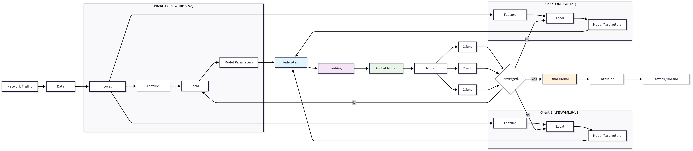

# Federated Learning for Network Intrusion Detection

This project implements and compares centralized and federated learning approaches for a Network Intrusion Detection System (NIDS) using PyTorch. The models are evaluated on multiple datasets, including UNSW-NB15 and a custom IoT dataset.

## Features
- **Centralized Training**: Trains DNN, LSTM, Decision Tree, and Random Forest models on individual datasets.
- **Federated Learning**: Simulates a federated environment with multiple clients using the Federated Averaging (FedAvg) algorithm.
- **Data Preprocessing**: Includes custom 5:1 under-sampling to handle class imbalance.
- **Comprehensive Evaluation**: Generates detailed performance metrics (Accuracy, Precision, Recall, F1-Score, AUC-ROC).
- **Rich Visualizations**: Automatically creates plots for model comparison, learning curves, and confusion matrices.

## Project Structure
```
nids-federated-learning/
├── data/               # Raw .csv datasets
├── figures/            # Saved output plots
├── logs/               # Log files from runs
├── src/                # Source code
├── .gitignore          # Files to be ignored by Git
├── config.py           # All hyperparameters and settings
├── LICENSE             # Project license
├── main.py             # Main script to run the experiment
├── README.md           # You are here
└── requirements.txt    # Python dependencies
```

## Installation

1.  Clone the repository:
    ```bash
    git clone [https://github.com/your-username/nids-federated-learning.git](https://github.com/your-username/nids-federated-learning.git)
    cd nids-federated-learning
    ```
2.  Create and activate a virtual environment (recommended):
    ```bash
    python -m venv venv
    source venv/bin/activate  # On Windows, use `venv\Scripts\activate`
    ```
3.  Install the required packages:
    ```bash
    pip install -r requirements.txt
    ```

## Usage

1.  Place your datasets (`unsw1.csv`, `unsw2.csv`, `IOT.csv`) into the `data/` directory.
2.  Adjust any hyperparameters or settings in `config.py` as needed.
3.  Run the main experiment script from the root directory:
    ```bash
    python main.py
    ```
4.  Results, logs, and figures will be saved to the `figures/` and `logs/` directories.




